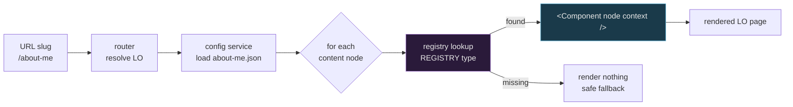
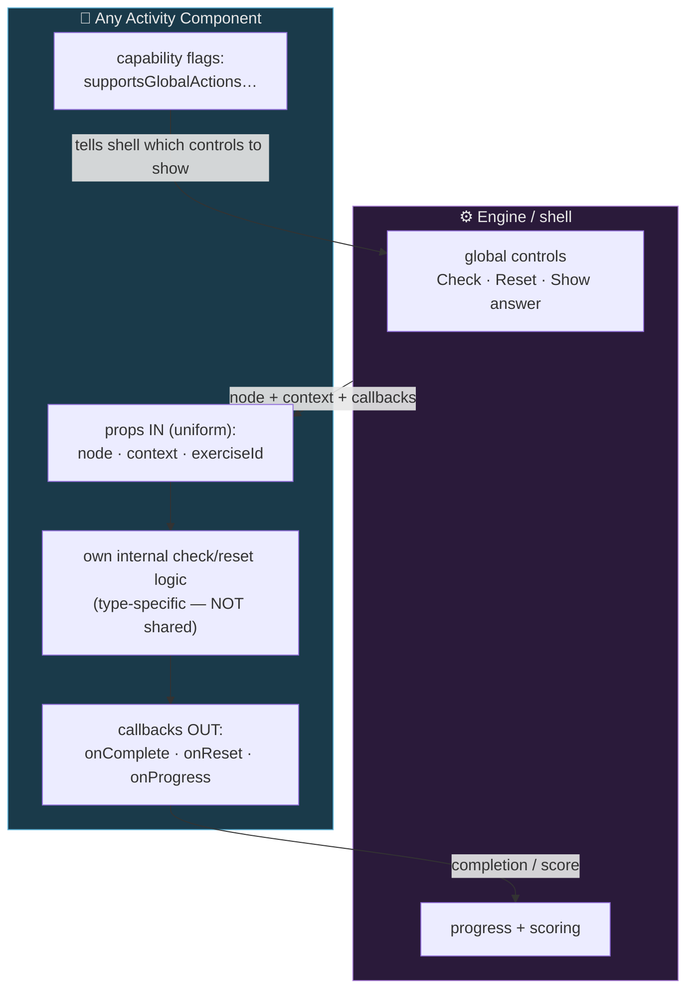
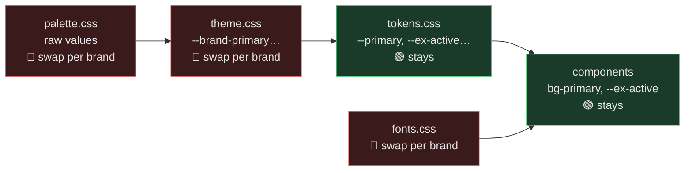
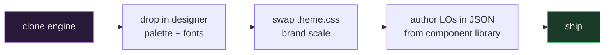
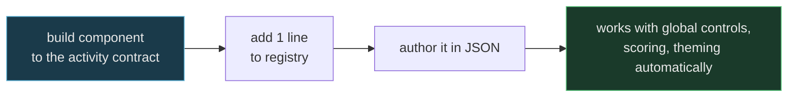

# Engine Architecture

How this codebase works as a **reusable language-course engine** — one engine, many courses, each differing only by *theme* (skin) and *content* (the learning objectives). New course = swap the skin + author content; the engine and component library stay untouched.

> Audience: developers joining the project or starting a new course (Spanish, Portuguese, …) on the same engine. Diagrams render on GitHub.

---

## 1. The four swappable layers

The system separates into four layers. Each is independently replaceable — that is the whole design.

```mermaid
flowchart TB
    subgraph THEME["🎨 THEME (skin) — swap per course/brand"]
        P[palette.css<br/>raw brand values]
        T[theme.css<br/>--brand-* scale + dark]
        TOK[tokens.css<br/>role aliases, --ex-*, component tokens]
        F[fonts.css<br/>@font-face]
        P --> T --> TOK
        F -.-> TOK
    end

    subgraph CONTENT["📦 CONTENT — author per course"]
        IDX[course index JSON<br/>list of LOs]
        LO[lo-config/*.json<br/>vocabulary · grammar ·<br/>pronunciation · exercises]
        IDX --> LO
    end

    subgraph LIB["🧩 COMPONENT LIBRARY — built once, reused"]
        EX[exercise blocks<br/>Select, DragFill, Match…]
        CB[content blocks<br/>Vocab, Grammar, PhraseTable…]
    end

    subgraph ENGINE["⚙️ ENGINE — rarely changes"]
        SHELL[App shell<br/>composition root]
        ROUTER[router<br/>slug ↔ LO]
        REG[component registry<br/>type → component]
        SVC[config service<br/>load + normalize JSON]
    end

    CONTENT -->|read by| SVC
    SVC --> SHELL
    ROUTER --> SHELL
    SHELL -->|dispatch via| REG
    REG -->|renders| LIB
    THEME -.->|CSS variables consumed by| LIB

    style THEME fill:#1a3a2a,stroke:#5ac47c,color:#e8e8e8
    style CONTENT fill:#3a2a1a,stroke:#d4a85a,color:#e8e8e8
    style LIB fill:#1a3a4a,stroke:#5ab0d4,color:#e8e8e8
    style ENGINE fill:#2a1a3a,stroke:#a87ed4,color:#e8e8e8
```

| Layer | Changes when… | Lives in |
|---|---|---|
| **Theme** | new brand/course skin | `src/styles/` |
| **Content** | new course or new LO | `src/lo-config/*.json`, course index |
| **Component library** | you add a new block/activity type | `src/components/` |
| **Engine** | (rarely) new core capability | `App`, `router/`, registry, config service |

---

## 2. Render flow — config to screen

An LO is JSON. The engine reads it, and for each declared block looks up the component in the **registry** and renders it. No `switch`, no engine edits to add blocks.



**Registry (the dispatch table):**
```js
// componentRegistry.js
export const COMPONENT_REGISTRY = {
  SelectExercise, DraggableFillGaps, PhraseTable, GrammarSection, /* … */
};
const Cmp = COMPONENT_REGISTRY[node.component];
return Cmp ? <Cmp node={node} context={ctx} /> : null;
```

> **Add a block = add one line to the registry.** Never a new `switch` branch.

---

## 3. The activity contract — how any new exercise type plugs in

The registry handles *which* component. The **activity contract** handles *how it integrates* with global controls, scoring, progress, and reset. Every exercise/activity implements the same interface — so a brand-new style (audio-record, speaking, drag-order…) drops in with zero engine changes.



**The contract:**
- **Props in (same for every activity):** `node` (its config/data), `context` (language, theme, flags), `exerciseId`.
- **Callbacks out:** `onComplete()`, `onReset()`, optional `onProgress(score)`.
- **Capability flags:** e.g. `supportsGlobalActions`, `supportsShowAnswer`, `supportsKeyboardEnter` — the shell reads these and renders the right controls generically.
- **Internal check/reset stays per-activity** — a drag reset is not a quiz reset. Shared *contract*, not shared *implementation*.

> **Golden rule:** if you must edit the shell to add an activity, the contract is incomplete — fix the contract, not the shell.

---

## 4. Theme cascade — fast re-skin

Components reference **role tokens** only, never raw colours. A new course swaps the top two layers; tokens and components are untouched.



🔴 = swap per course · 🟢 = untouched. See [THEME_ARCHITECTURE.md](./styling/THEME_ARCHITECTURE.md) for token mechanics.

---

## 5. Developer workflows

### Start a new course (e.g. Spanish)

No engine or component edits.

### Add a new activity type (e.g. audio-record)

No engine edits — that is the test of a correct contract.

---

## 6. Anti-patterns (do not)

- ❌ A `switch (component)` in the app to pick blocks → use the registry.
- ❌ Class components for blocks → function components + hooks (reuse).
- ❌ Theme/modal state threaded through the app component → React Context.
- ❌ Raw colour literals in components → role tokens only.
- ❌ Ad-hoc per-exercise callbacks → one activity contract.
- ❌ Editing the shell to add an activity → fix the contract instead.

> Full carry-forward rules: [process/FUTURE_PROJECTS.md](./process/FUTURE_PROJECTS.md) (anti-pattern #25 + Component Rendering Architecture).
